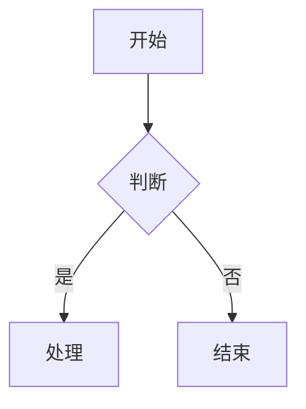

<!-- markdownlint-configure-file {"MD013": false, "MD024": false} -->

# 写作指南

本文是 `nano-blog` 的作者手册。每一条语法都给出**可以直接复制粘贴**的例子。

写作前的三条硬规则：

1. **正文中的 H1 是构建错误。** 文章标题只来自 frontmatter 的 `title`，正文一律从 `##` 开始。
2. **`index.md` 被禁用。** 目录索引只能叫 `_index.md`。
3. **frontmatter 使用严格校验。** 未知字段、重复字段、缺字段、多余空格都会让 `content:validate` 失败，而不是被静默忽略。

## 1. 文件与路径

内容放在两个集合下：

```text
posts/...    文章与文章目录
pages/...    独立页面
```

命名规则（构建期强制，违反即失败）：

| 规则           | 说明                                                                         |
| -------------- | ---------------------------------------------------------------------------- |
| 目录名与文件名 | 只能匹配 `[a-z0-9]+(?:-[a-z0-9]+)*`，小写 kebab-case                         |
| 扩展名         | 只有 `.md` 与 `.mdx`                                                         |
| 目录索引       | 只有 `_index.md`，且只能出现在 `posts/` 下                                   |
| `index.md`     | **禁止**，会报错 `uses "index"; directory indexes must be named "_index.md"` |
| 目录名 `page`  | 保留给分页，不能用作内容目录                                                 |
| 路径碰撞       | `a.md` 与 `a.mdx`、`a.md` 与 `a/_index.md` 同时存在会让构建失败              |
| 大小写         | 按 NFC 且不区分大小写检查碰撞，保证 Windows 与 Linux 构建一致                |

`.md` 与 `.mdx` 共享同一套 frontmatter schema、同一套标题 slug 规则和同一套清洗流程。只有当需要用到第 8 节的组件时，才需要写成 `.mdx`。

## 2. frontmatter 通用规则

- 使用 YAML，根节点必须是对象。**拒绝**重复键、未知键、YAML anchors、自定义 tags 与可执行类型。
- 字符串做 Unicode NFC 规范化，禁止控制字符。**首尾空白是错误，不会被自动去掉。**
- 日期必须是带明确时区偏移的完整 ISO 8601 datetime，例如 `2026-09-15T09:00:00+08:00`。`2026-09-15` 与 `2026-09-15T09:00:00` 都会被拒绝。
- URL 只允许 `https:`；站内路径必须以 `/` 开头。`javascript:`、`data:` 与协议相对地址一律拒绝。
- 长度一律按 **Unicode 码点**计算，所以中文标题不会被按 UTF-16 单位放宽到两倍。

## 3. 文章（post）

除 `_index.md` 外的 `posts/**/*.md(x)` 都按文章处理。

### 3.1 完整示例

```yaml
---
title: 用 Astro 内容集合组织一个长期写作的站点
description: 说明内容集合、路径规则与发布可见性如何配合，让站点在多年后仍然可以安全地增删文章。
publishedAt: 2026-09-15T09:00:00+08:00
updatedAt: 2026-10-02T14:20:00+08:00
draft: false
tags:
  - id: web-dev
    label: Web 开发
  - id: astro
    label: Astro
series:
  id: astro-notes
  title: Astro 笔记
  order: 1
cover:
  src: /media/0123456789abcdef0123456789abcdef0123456789abcdef0123456789abcdef/1600.webp
  alt: 浅色桌面上的键盘与笔记本，右侧有一杯茶
  width: 1600
  height: 900
  credit: 由 Nano 拍摄
lang: zh-CN
toc: auto
ogTitle: 用内容集合组织长期写作的站点
ogDescription: 内容集合、路径规则与发布可见性如何配合，让站点在多年后仍然可以安全地增删文章。
canonicalUrl: https://blog.example.invalid/posts/dev/web/astro-content-collections/
license: CC-BY-4.0
---
## 从路径开始
```

### 3.2 字段表

| 字段            | 类型         | 必填   | 规则                                         |
| --------------- | ------------ | ------ | -------------------------------------------- |
| `title`         | string       | 是     | 1–80 个 Unicode 字符                         |
| `description`   | string       | 是     | 40–160 个 Unicode 字符，**不从正文自动截取** |
| `publishedAt`   | ISO datetime | 是     | 必须带时区偏移                               |
| `updatedAt`     | ISO datetime | 否     | 存在时不得早于 `publishedAt`                 |
| `draft`         | boolean      | 否     | 缺省 `false`                                 |
| `tags`          | tag 数组     | 否     | 缺省空数组，最多 5 个                        |
| `series`        | series 对象  | 否     | 见 3.4                                       |
| `cover`         | cover 对象   | **是** | 见 3.5，必须能被媒体索引验证                 |
| `lang`          | literal      | 否     | 只能为 `zh-CN`，缺省 `zh-CN`                 |
| `canonicalUrl`  | https URL    | 否     | 缺省为站内 canonical                         |
| `toc`           | enum         | 否     | `auto` / `always` / `never`，缺省 `auto`     |
| `comments`      | boolean      | 否     | 缺省 `true`；`false` 表示这篇不接受评论      |
| `ogTitle`       | string       | 否     | 1–70 个字符                                  |
| `ogDescription` | string       | 否     | 40–160 个字符                                |
| `license`       | literal      | 否     | 只能为 `CC-BY-4.0`，缺省该值                 |

### 3.3 标签

```yaml
tags:
  - id: web-dev
    label: Web 开发
```

- `id` 必须是小写 ASCII kebab-case，它决定标签 URL（`/tags/web-dev/`）。
- `label` 为 1–24 个可见字符，是显示文本。
- 同一篇文章内 `id` 不能重复；整个 release 内同一个 `id` 只能对应一种 `label`。
- 最多 5 个，按作者书写顺序显示。

### 3.4 系列

```yaml
series:
  id: astro-notes
  title: Astro 笔记
  order: 1
```

- `id` 小写 ASCII kebab-case，决定系列 URL（`/series/astro-notes/`）。
- `title` 为 1–60 字符；同一个 `id` 的 `title` 必须全站一致。
- `order` 为大于 0 的整数，同一系列内必须唯一；系列详情页严格按 `order` 升序排列。

### 3.5 封面

```yaml
cover:
  src: /media/<64 位小写十六进制源文件 SHA-256>/1600.webp
  alt: 对画面信息的具体描述
  width: 1600
  height: 900
  credit: 可选的来源或署名
```

- `src` 只能指向媒体桶的内容寻址 `1600.webp`；`width` 必须恰好是 `1600`，`height` 必须恰好是 `900`，并与媒体记录一致。
- `alt` 为 4–160 个字符，必须是**对画面信息的描述**。文件名、`图片`、`封面`、`image`、`placeholder` 等占位文本会被拒绝。
- `credit` 可选，存在时 1–200 个纯文本字符；缺省时不渲染空的署名标签。
- 缺失、404、摘要不符、尺寸不足或 alt 无意义都会阻止发布。**所有文章都必须有真实封面。**

先用 `media:add --cover` 生成派生图，命令会把可直接粘贴的 `cover` 块打印出来：

```bash
pnpm media:add ./cover-source.jpg --alt "浅色桌面上的键盘与笔记本" --cover --credit "由 Nano 拍摄"
```

### 3.6 目录（toc）

```yaml
toc: auto
```

| 取值           | 行为                         |
| -------------- | ---------------------------- |
| `auto`（缺省） | 文章含至少 3 个 H2/H3 时显示 |
| `always`       | 至少 1 个 H2/H3 时显示       |
| `never`        | 从不显示                     |

目录只收录 H2 与 H3，不收录 H4 及更深层级。

### 3.7 评论开关（comments）

```yaml
comments: false
```

| 取值    | 行为                                                          |
| ------- | ------------------------------------------------------------- |
| `true`  | 缺省。文章页渲染评论区并接受提交。                            |
| `false` | 不渲染评论区、不加载评论脚本，其提交端点返回 403 并拒绝写入。 |

`false` 是**双向**的：页面不显示表单，服务端也不接受提交。只隐藏表单而端点仍然写入，等于把「不接受评论」变成「不显示评论」，任何直接 POST 端点的人都能绕过。

构建会把关闭评论的文章 id 写进 `/comments-closed.json`，评论端点读它来决定是否接受。这个文件与页面由同一份 frontmatter 生成，因此两者的判断不会互相矛盾。

### 3.8 草稿与未来时间

- `draft: true` **永远不公开**。新稿可以是空正文，校验只给 warning；它仍可随完整工作区进入私有 release，但永远不会出现在公开产物里。
- `publishedAt` 晚于构建时刻的文章不公开。
- 未来文章不会由常驻进程定时出现——到时间后需要一次新的构建。

### 3.9 可见性统一判定

生产页面、搜索、RSS、sitemap、标签计数、系列与相关文章共用同一条判定：

1. `draft: true` → 不公开；
2. `publishedAt` 晚于构建时刻 → 不公开；
3. 其他通过 schema 与媒体验证的文章 → 公开。

### 3.10 排序与阅读时间

排序固定为 `publishedAt` 倒序；完全相同时按 canonical path 升序。

预计阅读时间显示为“约 N 分钟”，算法为：

```text
max(1, ceil(CJK 可见字符数 / 500 + 拉丁单词数 / 220 + 代码非空行数 / 30))
```

统计时排除 frontmatter、图片 alt、代码围栏标记和组件属性。

## 4. 页面（page）

`pages/**/*.md(x)` 渲染为普通阅读页：沿用文章排版，但不显示发布时间、相关文章，也不强制封面。它们可以被搜索与 sitemap 收录，但**不进入**文章流、归档、标签和 RSS。

```yaml
---
title: 关于本站
description: 这个站点写什么、用什么搭起来，以及为什么它保持匿名。
updatedAt: 2026-09-15T09:00:00+08:00
draft: false
lang: zh-CN
noindex: false
license: CC-BY-4.0
---
## 这个站点

正文从这里开始。
```

| 字段           | 类型         | 必填 | 规则                           |
| -------------- | ------------ | ---- | ------------------------------ |
| `title`        | string       | 是   | 1–80 字符                      |
| `description`  | string       | 是   | 40–160 字符                    |
| `updatedAt`    | ISO datetime | 否   | 带偏移                         |
| `draft`        | boolean      | 否   | 缺省 `false`                   |
| `cover`        | cover 对象   | 否   | 存在时完整验证                 |
| `lang`         | literal      | 否   | 只能为 `zh-CN`                 |
| `canonicalUrl` | https URL    | 否   | 缺省站内 URL                   |
| `noindex`      | boolean      | 否   | 缺省 `false`，只由作者显式设置 |
| `license`      | literal      | 否   | 只能为 `CC-BY-4.0`             |

`pages/about.md` 是 `/about/` 的唯一许可内容覆盖；它不存在时仍会生成一个只含已确认事实的最小关于页。其余 page 不会自动加入主导航，并且与保留路由冲突时会让构建失败。

公开页面的正文必须非空；`draft: true` 的本地新稿可以为空并收到 warning。

### 4.1 独立页面的呈现

除 `about` 外的每个 page 都会在站点根部按自己的路径生成一个路由（`pages/lab/notes.md` → `/lab/notes/`，可以任意深）。它沿用文章排版，但按规格**不显示**以下内容：

- 发布时间与阅读时间（只显示可选的 `updatedAt`）；
- 相关文章；
- 系列导航与标签；
- 封面：`cover` 是可选的，存在时按文章封面同样的方式渲染。

正文与文章正文走同一条 Markdown 管线，因此代码块有复制按钮、标题有锚点链接、公式与图表按需加载、正文左侧的目录按自动规则显示。页面标记为 `noindex: true` 时既不会出现在 sitemap 中，也不会被搜索索引收录（`data-pagefind-body` 不再输出）；否则它可以被 Pagefind 与 sitemap 收录，但不进入文章流、归档、标签与 RSS。

## 5. 目录索引（_index.md）

只有 `posts/` 目录中的 `_index.md` 使用这套 schema。

```yaml
---
title: 开发
description: 浏览此目录下的公开文章与子目录。
order: 0
draft: false
---
这里是可选的目录导语，可以留空。
```

| 字段          | 类型       | 必填 | 规则                                                        |
| ------------- | ---------- | ---- | ----------------------------------------------------------- |
| `title`       | string     | 是   | 1–60 字符                                                   |
| `description` | string     | 是   | 20–160 字符                                                 |
| `order`       | integer    | 否   | 缺省 `0`，只影响同层子目录的排序                            |
| `draft`       | boolean    | 否   | 缺省 `false`；为 draft 时忽略自定义正文，但仍自动生成目录页 |
| `cover`       | cover 对象 | 否   | 完整验证                                                    |
| `lang`        | literal    | 否   | 只能为 `zh-CN`                                              |

目录正文可以为空，它只负责可选导语。**没有 `_index.md` 时目录页仍然存在**，只是标题与描述由站点自动生成：

- 标题 = 当前路径 segment 把连字符换成空格后的文本（不做翻译或大小写改写）；
- 描述 = `浏览此目录下的公开文章与子目录。`

`order` 取负值可以让某个子目录排在前面。

## 6. 路径到 URL 的映射

规则只有一套，没有例外：**文件的目录路径就是它的 URL 路径**。URL 中不含发布日期，所以改标题不会改变 URL。

| 内容对象相对路径          | 公开 URL                           |
| ------------------------- | ---------------------------------- |
| `posts/dev/web/a.md`      | `/posts/dev/web/a/`                |
| `posts/dev/web/a.mdx`     | `/posts/dev/web/a/`                |
| `posts/dev/web/_index.md` | `/posts/dev/web/` 的自定义目录内容 |
| `posts/_index.md`         | `/posts/`                          |
| `pages/about.md`          | `/about/`                          |
| `pages/lab/notes.md`      | `/lab/notes/`                      |

注意 `pages/` 这一层**不出现在 URL 里**：页面直接位于站点根部。

其他路径规则：

- 每个 posts 祖先目录都会自动生成索引页与面包屑，即使没有 `_index.md`。
- 所有 HTML URL 使用尾斜杠；`rss.xml`、`robots.txt`、sitemap 与静态资源除外。
- 路径变更必须在 `public/_redirects` 中显式添加一条 301，校验会检查循环、链式跳转与目标缺失（见 6.1）。

### 6.1 重定向表（`public/_redirects`）

文件采用 Cloudflare Pages 的格式，每行一条规则，`#` 之后是注释：

```text
/posts/old/path/  /posts/new/path/  301
```

`content:validate` 与 `content:publish` 都会检查这张表，以下情况让校验失败并返回退出码 3：

| 情况           | 说明                                                              |
| -------------- | ----------------------------------------------------------------- |
| 循环           | `a → b → c → a` 这类闭环，无论经过几条规则                        |
| 链式跳转       | 目标本身又被另一条规则重定向；应直接指向链尾，让读者只跳一次      |
| 目标缺失       | 目标不是本次发布会产生、也不属于站点自有路由或静态文件的页面      |
| 通配符与占位符 | `*` 与 `:param` 属于 catch-all，规格禁止把未知旧 URL 统一导向一处 |
| 状态码非法     | 只接受 `301`、`302`、`303`、`307`、`308`；省略时默认 `301`        |
| 同一来源重复   | 一个 source 只能出现一次                                          |

校验把本次内容源实际产生的 URL，加上站点自有路由（`/`、`/posts/`、`/archive/`、`/tags/`、`/series/`、`/search/`、`/about/`、`/404.html`）与静态文件（`/rss.xml`、`/robots.txt`、`/favicon.svg`）一起作为合法目标集合。因此指向 `/posts/` 的规则不会因为「那条 URL 没有对应内容文件」而被误报。尾斜杠在比较时被忽略，但带扩展名的文件路径（如 `/rss.xml`）不会被补上尾斜杠。

系统保留的 URL（内容不能占用）：`/`、`/page/<n>/`、`/posts/` 及自动 posts 路由、`/archive/`、`/tags/`、`/series/`、`/search/`、`/about/`、`/rss.xml`、`/robots.txt`、sitemap、`/404.html`、`/_pagefind/`、`/assets/`、`/og/`。

## 7. 标题与锚点

正文一律从 `##` 开始。**H1 出现在正文中是构建错误**：

```text
An H1 appears in the body of a document. The article title is the only H1; start body headings at H2.
```

锚点 slug 的生成规则（一旦发布就是永久地址，算法不会变）：

| 情况                             | 结果                |
| -------------------------------- | ------------------- |
| 纯拉丁标题 `Getting Started`     | `getting-started`   |
| 含中文的标题 `从路径开始`        | `section-<hash8>`   |
| 转换后为空（例如全是标点的标题） | `section-<hash8>`   |
| 重复的标题                       | 依次追加 `-2`、`-3` |

`<hash8>` 是标题文本 NFC 规范化后 SHA-256 的前 8 个小写十六进制字符。

```markdown
## 从路径开始
```

```markdown
## Getting started
```

两个标题都会得到一个稳定的锚点，并在悬停/聚焦时显示一个可复制的链接图标；复制的链接是 canonical URL 加 hash。

## 8. Markdown 语法

### 8.1 段落与内联标记

```markdown
普通段落，包含 **粗体**、_斜体_、~~删除线~~、`行内代码`、[站内链接](/posts/) 与 [外部链接](https://example.invalid)。
```

外链会自动附加一个只在读屏器中可见的「（外部链接）」提示，并**默认在当前标签页打开**——正文语法不提供强制新窗口的属性。

### 8.2 列表与任务列表

```markdown
- 无序项一
- 无序项二
  - 嵌套项

1. 有序项一
2. 有序项二

- [x] 已完成的任务
- [ ] 未完成的任务
```

### 8.3 表格

```markdown
| 字段          | 类型   | 说明            |
| ------------- | ------ | --------------- |
| `title`       | string | 文章标题        |
| `description` | string | 摘要，40–160 字 |
```

宽表格会放进自己的横向滚动容器，不会把整页撑宽。

### 8.4 脚注

```markdown
正文引用了脚注[^1]，也引用了第二个[^2]。

[^1]: 第一条脚注。

[^2]: 第二条脚注。
```

脚注在文末生成返回引用的链接；重复引用都可以返回。

### 8.5 代码块

fence 的信息串语法是：

```text
<language> title="可选标题" showLineNumbers {2,4-6}
```

一个完整的例子：

````markdown
```ts title="示例代码" showLineNumbers {2,4-5}
type Greeting = { readonly text: string };

const greeting: Greeting = { text: "hello" };
console.log(greeting.text);
export { greeting };
```
````

一个不带任何选项的短块：

````markdown
```js
const answer = 42;
```
````

语法细节：

- `title=` 的值必须用双引号包裹且非空。
- `{...}` 中的行号从 **1** 开始，可以是单行（`2`）或前向区间（`4-6`），用逗号连接。
- `showLineNumbers` 缺省关闭。
- 解析器**故意严格**：未闭合的引号、倒序区间（`6-4`）、`0` 或负数、超出实际行数的行号、未知选项都会让构建失败。
- 未知语言不会让构建崩溃：Shiki 会退回纯文本并打印一条构建期警告（`[Shiki] The language … doesn't exist, falling back to "plaintext".`）。注意这条警告只出现在构建日志里，`content:validate` 不会为未知语言报错。
- 代码在构建期由 Shiki 高亮，主题固定为 `github-dark`；文章页不会加载任何高亮运行时。

> [!IMPORTANT]
> 当前构建的实际渲染与规范有差距，写作者需要知道：围栏信息串**会被正确解析和校验**，构建产物上也会带上 `data-title`、`data-line-numbers`、`data-highlight` 属性，高亮行也会得到 `line--highlighted` 类；但页面模板没有生成配套的 `.code-block` 外壳，因此**目前看不到标题栏、行号和复制按钮**，相关的 CSS 与复制脚本都因为找不到 `.code-block` 祖先元素而不生效。详见本仓库的验收报告。

### 8.6 提示块（GitHub alerts）

```markdown
> [!NOTE]
> 说明块的内容。
```

```markdown
> [!TIP]
> 提示块的内容。
```

```markdown
> [!IMPORTANT]
> 重要块的内容。
```

```markdown
> [!WARNING]
> 警告块的内容。
```

```markdown
> [!CAUTION]
> 注意块的内容。
```

五种类型固定，渲染出的可访问中文标签依次是「说明、提示、重要、警告、注意」：

| 标记             | 渲染标签 |
| ---------------- | -------- |
| `> [!NOTE]`      | 说明     |
| `> [!TIP]`       | 提示     |
| `> [!IMPORTANT]` | 重要     |
| `> [!WARNING]`   | 警告     |
| `> [!CAUTION]`   | 注意     |

**未知类型不会被自动支持。** 例如 `> [!DANGER]` 会按普通引用块渲染，并在校验时报错——不能在写作时临场创造新样式。

### 8.7 边注

```markdown
:::sidenote[可选标签]
边注正文，支持 Markdown。
:::
```

也可以不带标签：

```markdown
:::sidenote
没有标签的边注。
:::
```

**宽屏（≥75rem）**：边注浮在正文右侧的 `240px` 栏中并 `clear: right`，不会覆盖相邻边注或正文。

**窄屏（<75rem）**：边注移入屏幕右侧的悬浮面板，原文位置留下一个编号标记 `[1]`。

- 点击标记会打开面板并定位到该条边注，关闭面板后标记仍在。
- 标记是真实的 `#sidenote-N` 锚点链接，因此**没有 JavaScript 时同样可用**——只是不会自动展开面板。
- 面板与左侧的目录面板互斥：打开一个会关闭另一个，因为两者在手机宽度下会重叠。
- 跨断点缩放会双向还原：放大到宽屏时边注回到正文原位，缩小后重新进入面板。

打印样式会把边注展开并编号，并去掉标记本身（注文就在文中，标记不再有意义）。编号由页面脚本统一分配，Markdown 边注与 MDX `<Sidenote>` 共用同一套编号。

**目录同理**：宽屏下是左栏的固定列表；窄屏下成为左缘的悬浮面板，点击「目录」标签展开，同样与边注面板互斥。

### 8.8 数学（KaTeX）

```markdown
行内公式 $a^2 + b^2 = c^2$。

$$
\int_{0}^{1} x^{2}\,\mathrm{d}x = \frac{1}{3}
$$
```

行内公式用单美元界定，块级公式用双美元界定。构建期由 `rehype-katex` 渲染，并保留可访问的 MathML。

> [!WARNING]
> 当前构建没有引入 KaTeX 的样式表，也没有自托管 KaTeX 字体：页面里会输出 `katex`、`katex-mathml`、`katex-html` 标记，但没有任何 CSS 让它们正确排布与隐藏 MathML 副本，因此公式在浏览器中看起来是错乱的。详见本仓库的验收报告。

### 8.9 图表（Mermaid）

````markdown

````

- Mermaid 代码只在含图表的页面加载，并且延迟到图表进入视口才初始化。
- 页面保留原始文本作为无 JavaScript 时的 fallback；渲染成功后才隐藏源码。
- 渲染使用 `securityLevel: 'strict'`：不允许 HTML label、点击回调、外部资源、任意链接协议或主题注入。
- 渲染失败时显示带语言标签的源码和「图表无法渲染，以下为图表源码。」，不会留空。
- 切换深浅主题后会重新渲染；减少动画模式下关闭图表动画。

### 8.10 原始 HTML

Markdown 中的原始 HTML 会经过白名单清洗。**允许**的元素是：

```text
a  abbr  blockquote  br  code  del  details  em  figcaption  figure
h2  h3  h4  h5  h6  hr  img  input  kbd  li  mark  ol  p  pre
strong  sub  summary  sup  table  tbody  td  tfoot  th  thead  tr  ul
```

允许的属性是逐元素的：

| 元素                | 允许的属性                                             |
| ------------------- | ------------------------------------------------------ |
| `a`                 | `href`、`title`                                        |
| `abbr`              | `title`                                                |
| `img`               | `src`、`alt`、`width`、`height`、`loading`、`decoding` |
| `input`             | `type`（被强制为 `checkbox`）、`checked`、`disabled`   |
| `li`                | `value`                                                |
| `ol`                | `start`、`reversed`、`type`                            |
| `td`                | `colspan`、`rowspan`、`headers`、`align`               |
| `th`                | `colspan`、`rowspan`、`headers`、`scope`、`align`      |
| `details`           | `open`                                                 |
| `del`、`blockquote` | `cite`                                                 |

其余元素不保留任何属性。`href` 允许 `http`、`https`、`mailto`；`src` 与 `cite` 只允许 `http`、`https`。

**会被移除的**：`script`、`style`、`iframe`、`object`、`embed`、`form`、`svg`、`math`、`canvas`、`video`、`audio`、`template`、`link`、`meta`、`base`、`button`、`select`、`textarea`、`noscript`、`slot`、`source`、`track`、`frame`、`frameset`、`applet`、`title`（这些连同子节点一起删除）。

同时被剥掉的是每个元素的 `class`、`style`、`id`、`on*` 事件处理器、`data-*`、`aria-*` 以及不在上表中的一切属性。`javascript:`、`data:`、`vbscript:`、`file:`、`blob:` 与协议相对地址（`//host/x`）的 URL 会被删除。

一个合法的例子：

```html
<div>
  <p>原始 HTML 中的 <strong>允许标签</strong> 会保留。</p>
  <p>
    <abbr title="超文本标记语言">HTML</abbr>、<kbd>Ctrl</kbd>、<mark>标记</mark>
    与 H<sub>2</sub>O 也应保留。
  </p>
</div>
```

注意 `div` 与 `span` 在 **Markdown 中不被保留**（它们不在上表中），只在 MDX 的原始标签白名单里出现。需要结构化容器时，请在 MDX 中写。

### 8.11 图片

```markdown

```

- `alt` 必填，并且是对画面信息的描述。
- `src` 应当是 `/media/...` 路径。构建期会依据媒体记录校验该路径确实是这个素材的派生图之一，并生成 `picture` / `srcset`，把公开地址重写为 `https://media.example.invalid`。
- 空 alt 只允许在 MDX 中通过 `<Figure decorative />` 明确声明，且装饰图不能作为封面。
- 外部素材必须先确认使用权，再用 `media:add` 导入，不要直接热链第三方图片。

`media:add` 会打印一行可直接粘贴的标准 Markdown 图片语法。

## 9. MDX 组件白名单

`.mdx` 文件**只能**使用下面九个组件。组件由文章 layout 显式传入，内容不能自行解析模块。

同时被拒绝的还有：

- `import`、`export`、`script`、`style`、`iframe` 与任何未知组件；
- `client:*` 指令、`set:` / `is:` 指令与 `dangerouslySet*`；
- 除 string / number / boolean / null 之外的 JavaScript 表达式，以及所有 spread props 与事件处理器（`on*`）；
- 非 `https`、协议相对、`data:` 的 URL 属性；
- 片段（`<>...</>`）。

MDX 中允许的原始 HTML 标签比 Markdown 更窄，只有：`p`、`br`、`em`、`strong`、`del`、`blockquote`、`ul`、`ol`、`li`、`a`、`hr`、`abbr`、`kbd`、`mark`、`sup`、`sub`、`code`、`span`、`div`、`details`、`summary`、`table`、`thead`、`tbody`、`tr`、`th`、`td`。`.mdx` 有组件可以表达结构化内容，所以原始标记只留给行内语义。

组件的属性也是严格校验的：**未知属性是错误**。

### 9.1 Callout

属性：`type`（必填，`NOTE` / `TIP` / `IMPORTANT` / `WARNING` / `CAUTION`）、`title`（可选，1–120 字符）。

```mdx
<Callout type="NOTE">通过组件渲染的说明块。</Callout>

<Callout type="WARNING" title="自定义标题">
  带自定义标题的警告块。
</Callout>
```

### 9.2 Figure

属性：`src`（必填）、`alt`、`caption`、`credit`、`decorative`、`width`、`sizes`。

`sizes` 默认值对应正文栏宽（`(min-width: 48rem) 42rem, 100vw`），适合大多数插图。
放进 `<Gallery>` 的图渲染在网格轨道里，宽度约为正文栏的一半，应显式传入更窄的
`sizes`，否则浏览器会下载约两倍于所需的尺寸：

```mdx
<Gallery>
  <Figure
    src="/media/…/800.webp"
    alt="…"
    sizes="(min-width: 48rem) 21rem, 100vw"
  />
</Gallery>
```

```mdx
<Figure
  src="/media/0123456789abcdef0123456789abcdef0123456789abcdef0123456789abcdef/1200.webp"
  alt="宽幅示意图，包含条纹与圆形色块"
  caption="图片说明文字"
  credit="由 Nano 拍摄"
/>
```

装饰图必须显式声明：

```mdx
<Figure
  src="/media/0123456789abcdef0123456789abcdef0123456789abcdef0123456789abcdef/800.webp"
  alt=""
  decorative={true}
/>
```

非装饰图缺少 alt 会让构建失败：`Figure … needs alt text. Use decorative={true} only for an image that carries no information.`

### 9.3 Gallery

属性：`caption`（可选）。子元素为若干 `Figure`。

```mdx
<Gallery caption="图库说明">
  <Figure
    src="/media/0123456789abcdef0123456789abcdef0123456789abcdef0123456789abcdef/1200.webp"
    alt="图库中的第一张示意图"
  />
  <Figure
    src="/media/aaaaaaaaaaaaaaaaaaaaaaaaaaaaaaaaaaaaaaaaaaaaaaaaaaaaaaaaaaaaaaaa/1600.webp"
    alt="图库中的第二张示意图"
  />
</Gallery>
```

写作约定是 2–6 张；键盘顺序与源码顺序一致，不实现 lightbox。

### 9.4 Sidenote

属性：`label`（可选，1–120 字符）。正文支持 Markdown。

```mdx
<Sidenote label="组件边注">
  这是通过 MDX 组件写的边注，编号由页面统一分配。
</Sidenote>
```

### 9.5 VideoEmbed

属性：`provider`（必填，只能是 `youtube` 或 `bilibili`）、`id`（必填）、`title`（必填）、`poster`（必填）。

```mdx
<VideoEmbed
  provider="youtube"
  id="dQw4w9WgXcQ"
  title="视频标题"
  poster="/media/aaaaaaaaaaaaaaaaaaaaaaaaaaaaaaaaaaaaaaaaaaaaaaaaaaaaaaaaaaaaaaaa/1600.webp"
/>
```

```mdx
<VideoEmbed
  provider="bilibili"
  id="BV1xx411c7mD"
  title="视频标题"
  poster="/media/aaaaaaaaaaaaaaaaaaaaaaaaaaaaaaaaaaaaaaaaaaaaaaaaaaaaaaaaaaaaaaaa/1600.webp"
/>
```

- YouTube id 必须匹配 `^[A-Za-z0-9_-]{11}$`；iframe 固定为 `https://www.youtube-nocookie.com/embed/<id>`。
- Bilibili id 必须匹配 `^BV[0-9A-Za-z]{10}$`；iframe 固定为 `https://player.bilibili.com/player.html?bvid=<id>`。
- 初始只显示本地 poster、标题、提供方与「加载视频」按钮，**只有用户明确点击后才创建 iframe**；在此之前不向第三方发送任何请求。
- 不可用时保留一个指向提供方的普通链接。

### 9.6 AudioPlayer

属性：`src`（必填，必须来自媒体索引）、`title`（必填）、`transcript`（可选）。

```mdx
<AudioPlayer
  src="/media/bbbbbbbbbbbbbbbbbbbbbbbbbbbbbbbbbbbbbbbbbbbbbbbbbbbbbbbbbbbbbbbb/original.mp3"
  title="音频标题"
  transcript="逐字稿内容，会放进一个可折叠的区块。"
/>
```

使用原生 `audio controls preload="none"`，并提供下载链接。源不在媒体索引中时构建失败。

### 9.7 Tabs 与 Tab

`Tabs` 属性：`label`（可选，1–120 字符）。`Tab` 属性：`label`（必填，1–120 字符）。

```mdx
<Tabs label="选项卡">
  <Tab label="第一页">第一页的内容。</Tab>
  <Tab label="第二页">第二页的内容。</Tab>
</Tabs>
```

服务端默认按顺序渲染**所有** panel，每个 panel 前显示它的 label 标题；增强脚本成功后才切换为单 panel 的 tabs。脚本失败或关闭 JavaScript 时不会隐藏任何内容。键盘支持方向键、Home、End。

### 9.8 Details

属性：`summary`（必填，1–200 字符）、`open`（可选）。

```mdx
<Details summary="折叠标题">折叠区块中的内容，使用原生 details 元素。</Details>
```

## 10. 常见错误

| 报错                                                            | 原因                                     |
| --------------------------------------------------------------- | ---------------------------------------- |
| `An H1 appears in the body of a document.`                      | 正文里写了 `#`。改成 `##`。              |
| `… uses "index"; directory indexes must be named "_index.md".`  | 文件名写成了 `index.md`。                |
| `Directory segment "page" … is reserved for pagination.`        | 目录名叫 `page`。                        |
| `Title must be 1–80 characters long, but is N.`                 | 标题长度越界（按码点）。                 |
| `Description must be 40–160 characters long, but is N.`         | 摘要长度越界。                           |
| `Description must not begin or end with whitespace.`            | frontmatter 值首尾有空格。               |
| `publishedAt must be a valid ISO 8601 datetime with an offset.` | 日期缺时区偏移。                         |
| `Alt text … is a placeholder, not a description of the image.`  | alt 写成了 `图片` 之类的占位词。         |
| `Code fence title must be double-quoted: …`                     | `title=` 的值没有用双引号。              |
| `Highlight range 6-4 is reversed in code fence: …`              | 行号区间写反了。                         |
| `Highlight line 9 is beyond the end of a 5-line code block: …`  | 高亮行超出代码实际行数。                 |
| `<Foo> is not a whitelisted component. Allowed: …`              | 用了白名单外的 MDX 组件。                |
| `import and export statements are not allowed in content; …`    | `.mdx` 里写了 `import`/`export`。        |
| `… is not a media object recorded for this release.`            | 引用了没有媒体记录的 `/media/...` 路径。 |

写完后先跑一次本地校验，再考虑发布：

```bash
pnpm content:validate
```

完整的发布顺序见 [RELEASE_RUNBOOK.md](RELEASE_RUNBOOK.md)。
