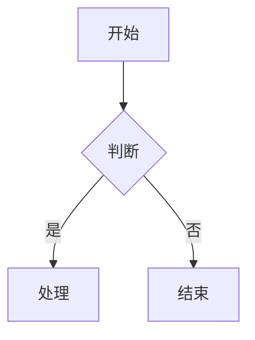

## 段落与内联标记

TEST FIXTURE 段落，包含 **粗体**、_斜体_、~~删除线~~、`行内代码`、[站内链接](/posts/) 与 [外部链接](https://example.invalid)。

需要保留原样的字符：\<div\> 与 &amp; 都写成了实体。

## 列表

- 无序项一
- 无序项二
  - 嵌套项

1. 有序项一
2. 有序项二

- [x] 已完成的任务
- [ ] 未完成的任务

## 提示块

> [!NOTE]
> TEST FIXTURE 说明块。

> [!TIP]
> TEST FIXTURE 提示块。

> [!IMPORTANT]
> TEST FIXTURE 重要块。

> [!WARNING]
> TEST FIXTURE 警告块。

> [!CAUTION]
> TEST FIXTURE 注意块。

## 代码

```ts title="示例代码" showLineNumbers {2,4-5}
type Greeting = { readonly text: string };

const greeting: Greeting = { text: "hello" };
console.log(greeting.text);
export { greeting };
```

一个没有标题也没有行号的短块：

```js
const answer = 42;
```

## 表格

| 列名称        | 类型     | 说明                 |
| ------------- | -------- | -------------------- |
| `title`       | string   | 文章标题             |
| `description` | string   | 摘要，40–160 字      |
| `publishedAt` | datetime | 带时区偏移的发布时间 |

## 数学

行内公式 $a^2 + b^2 = c^2$，以及块级公式：

$$
\int_{0}^{1} x^{2}\,\mathrm{d}x = \frac{1}{3}
$$

## 图表



## 边注

:::sidenote[TEST FIXTURE 边注]
这是一条边注，用于验证宽屏浮动与窄屏折叠两种呈现。
:::

## 脚注

正文引用了脚注[^1]，也引用了第二个[^2]。

[^1]: TEST FIXTURE 第一条脚注。

[^2]: TEST FIXTURE 第二条脚注。

## 原始 HTML

<div>
  <p>TEST FIXTURE 原始 HTML 中的 <strong>允许标签</strong> 会保留。</p>
  <p><abbr title="TEST FIXTURE">缩写</abbr>、<kbd>Ctrl</kbd>、<mark>标记</mark> 与 H<sub>2</sub>O 也应保留。</p>
</div>
